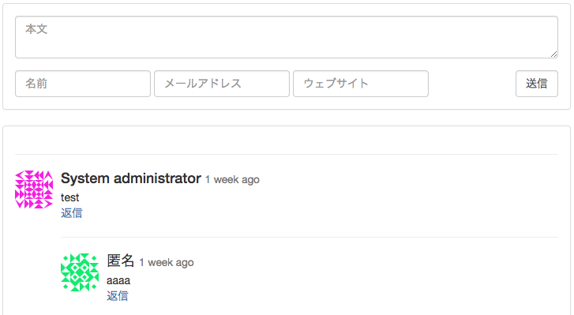
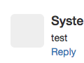
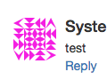
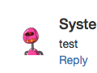
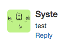

# Commentbox パッケージ for fuelphp

このパッケージは FuelPHP に埋め込み型のコメント領域を簡単に追加することが出来ます。

## 必須およびオプションの環境

* php 5.3 もしくはそれ以降
* FuelPHP 1.7 もしくはそれ以降
* ORM パッケージ
* Auth パッケージ (オプション)

## インストール方法

1. ``` PKGPATH ``` に展開([Packages - General - FuelPHP Documentation](http://fuelphp.com/docs/general/packages.html)を参照)
2. ``` APPPATH/config/config.php ``` の ``` 'always_load' => array('packages' => array()) ``` に ```commentbox``` を追加し、ORM パッケージが追加されていることを確認
3. ``` php oil r migrate --packages=commentbox ``` を実行しデータベースにテーブルを作成

## 使い方

### コントローラの実装例

    class Controller_Index extends Controller
    {
        public function action_hoge($id)
        {
            $commentbox = Commentbox::forge();
            if (Input::post())
            {
                // Commentbox のための検証
                if ($commentbox->run())
                {
                    Response::redirect(Uri::create(Uri::string()));
                }
            }
            return
                Response::forge(
                    View::forge('index/hoge')
                        ->set_safe('commentbox', $commentbox)
                );
        }
    }

### ビューの実装例

    <?php echo $commentbox->render(); ?>

### 画面例

デフォルトのフォームテンプレートでの表示は次のようになります。



## 設定

| キー名                    | 初期値            | 説明 |
|--------------------------|------------------|-------------|
| `'table_name'`           | `'commentboxes'` | テーブル名 |
| `'guest'`                |      `true`      | ゲストコメントの許可 |
| `'avatar'`               |                  | アバター設定 |
| `'avatar.size'`          |       `48`       | アバターのアイコンサイズ |
| `'avatar.service'`       |   `'gravatar'`   | アバターサービス ( `none` か `blank` か `gravatar` か  `robohash` か `adorable` ) |
| `'avatar.gravatar'`      |                  | Gravatar オプション、 [Gravatar - Globally Recognized Avatars](http://en.gravatar.com/site/implement/images/) を参照 |
| `'avatar.robohash'`      |                  | RoboHash オプション、 [RoboHash](http://robohash.org/) を参照 |
| `'recaptcha'`            |                  | [reCAPTCHA](https://developers.google.com/recaptcha/) 設定 |
| `'recaptcha.enable'`     |      `false`     | reCAPTCHA を有効または無効にする |
| `'recaptcha.always_use'` |      `false`     | 常にreCAPTCHAを使用する、ゲストとログイン |
| `'recaptcha.site_key'`   |                  | Site key |
| `'recaptcha.secret_key'` |                  | Secret key |
| `'user_page'`            | `'users/{user_name}'` | ユーザーページへのリンク |
| `'active'`               |    `'default'`   | アクティブな commentbox テンプレート |
| `'default'`              |                  | デフォルトの commentbox テンプレート |
| `'disqus'`               |                  | disqus 風 commentbox テンプレート |
| `'stackoverflow'`        |                  | stackoverflow 風 commentbox テンプレート |

### アバターサービス

| アバターサービス | 例 | 説明 |
|----------------|------------------------------------------------------------------|--------------------------------------------------------------------|
| `'none'` |  | アバターのアイコンを表示しない |
| `'blank'` |  | 空白のボックス |
| `'gravatar'` |  | [Gravatar - Globally Recognized Avatars](http://gravatar.com/) を参照 |
| `'robohash'` |  | [RoboHash](http://robohash.org/) を参照 |
| `'adorable'` |  | [Adorable Avatars!](http://avatars.adorable.io/) を参照 |

### reCAPTCHA の表示マトリックス

| **未ログイン**                 | `'recaptcha.always_use' === false` | `'recaptcha.always_use' === true` |
|--------------------------------|------------------------------------|-----------------------------------|
| `'recaptcha.enable' === false` |      reCAPTCHA は表示されない      |      reCAPTCHA は表示されない     |
| `'recaptcha.enable' === true`  |     **reCAPTCHA は表示される**     |     **reCAPTCHA は表示される**    |

| **ログイン**                    | `'recaptcha.always_use' === false` | `'recaptcha.always_use' === true` |
|--------------------------------|------------------------------------|-----------------------------------|
| `'recaptcha.enable' === false` |      reCAPTCHA は表示されない      |      reCAPTCHA は表示されない     |
| `'recaptcha.enable' === true`  |      reCAPTCHA は表示されない      |     **reCAPTCHA は表示される**    |

## ライセンス

この fuelphp パッケージは MIT ライセンスの下でリリースされています、 [LICENSE.ja.md](LICENSE.ja.md) を参照してください。
