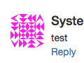
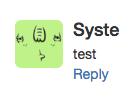

# Commentbox package for fuelphp

This package allows you to easily add embedded comments area to FuelPHP.

## Required and optional environment

* php 5.3 or later
* FuelPHP 1.7 or later
* ORM package
* Auth package (optional)

## How to install

1. Expand to ``` PKGPATH ``` (see [Packages - General - FuelPHP Documentation](http://fuelphp.com/docs/general/packages.html))
2. Add a ```commentbox``` to ``` 'always_load' => array('packages' => array()) ``` of ``` APPPATH/config/config.php ```, and confirm that the ORM package has been added.
3. Create a table in the database by execute the ``` php oil r migrate --packages=commentbox ``` .

## How to use

### implementation example of Controller

    class Controller_Index extends Controller
    {
        public function action_hoge($id)
        {
            $commentbox = Commentbox::forge();
            if (Input::post())
            {
                // Validation for Commentbox
                if ($commentbox->run())
                {
                    Response::redirect(Uri::create(Uri::string()));
                }
            }
            return
                Response::forge(
                    View::forge('index/hoge')
                        ->set_safe('commentbox', $commentbox)
                );
        }
    }

### Implementation example of View

    <?php echo $commentbox->form(); ?>
    <?php echo $commentbox->comments(); ?>

### Screen example

Display of the default form template is as follows.


## Configuration

| key name                 | default          | description |
|--------------------------|------------------|-------------|
| `'table_name'`           | `'commentboxes'` | table name |
| `'guest'`                |      `true`      | permission of guest comment |
| `'avatar'`               |                  | avatar config |
| `'avatar.size'`          |       `48`       | avatar icon size |
| `'avatar.service'`       |   `'gravatar'`   | avatar service ( `none` or `blank` or `gravatar` or  `robohash` or `adorable` ) |
| `'avatar.gravatar'`      |                  | Gravatar options, see [Gravatar - Globally Recognized Avatars](http://en.gravatar.com/site/implement/images/) |
| `'avatar.robohash'`      |                  | RoboHash options, see [RoboHash](http://robohash.org/) |
| `'recaptcha'`            |                  | [reCAPTCHA](https://developers.google.com/recaptcha/) config |
| `'recaptcha.enable'`     |      `false`     | enable or disable reCAPTCHA |
| `'recaptcha.always_use'` |      `false`     | always use reCAPTCHA, guest and logged in |
| `'recaptcha.site_key'`   |                  | Site key |
| `'recaptcha.secret_key'` |                  | Secret key |
| `'active'`               |    `'default'`   | the active commentbox template |
| `'default'`              |                  | default commentbox template |

### Avatar service

| avatar service | example | description |
|----------------|------------------------------------------------------------------|--------------------------------------------------------------------|
| `'none'` |  | Do not show an avatar icon |
| `'blank'` |  | blank box |
| `'gravatar'` |  | see [Gravatar - Globally Recognized Avatars](http://gravatar.com/) |
| `'robohash'` |  | see [RoboHash](http://robohash.org/) |
| `'adorable'` |  | see [Adorable Avatars!](http://avatars.adorable.io/) |

### reCAPTCHA display matrix

| **not logged in**              | `'recaptcha.always_use' === false` | `'recaptcha.always_use' === true` |
|--------------------------------|------------------------------------|-----------------------------------|
| `'recaptcha.enable' === false` |     reCAPTCHA is not displayed     |     reCAPTCHA is not displayed    |
| `'recaptcha.enable' === true`  |     **reCAPTCHA is displayed**     |     **reCAPTCHA is displayed**    |

| **logged in**                  | `'recaptcha.always_use' === false` | `'recaptcha.always_use' === true` |
|--------------------------------|------------------------------------|-----------------------------------|
| `'recaptcha.enable' === false` |     reCAPTCHA is not displayed     |     reCAPTCHA is not displayed    |
| `'recaptcha.enable' === true`  |     reCAPTCHA is not displayed     |     **reCAPTCHA is displayed**    |

## License

This fuelphp package is released under the MIT License, see [LICENSE.md](LICENSE.md).
